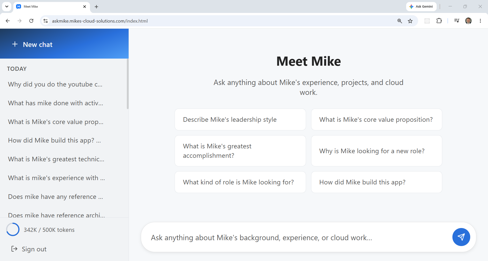

# AWS RAG Demo

A **ChatGPT-style chat application** that lets users ask natural language
questions about Mike Monaco's multi-cloud reference architecture portfolio.
Answers are grounded in content indexed from public GitHub repositories
across AWS, GCP, Azure, and OCI projects.

Built on **AWS Lambda**, **Amazon API Gateway**, **Amazon DynamoDB**,
**Amazon SQS**, **Amazon Bedrock**, and **Amazon S3** — fully serverless,
no EC2 instances required.



## How It Works

1. A one-time ingest script crawls all public GitHub repos (`README.md` and
   `CLAUDE.md` per repo), chunks the text, embeds each chunk via **Bedrock
   Titan Embeddings v2**, and stores the corpus in S3.
2. Users log in via **Amazon Cognito** and ask questions in a
   ChatGPT-style interface.
3. Each question is embedded, compared against the corpus using cosine
   similarity, and the top 5 matching chunks are injected as context into a
   **Bedrock Claude Haiku** prompt.
4. The last 5 Q&A pairs from the conversation are included as history,
   making conversations stateful across turns.
5. Answers are returned asynchronously via **SQS** — the frontend polls
   until complete.

Per-user token budgets (500K lifetime) are tracked in DynamoDB. The app
supports up to 100 concurrent users.

## Architecture

### Request Flow

```
User question
  → POST /conversations/{id}/queries  (API Lambda)
  → S3: question.txt written
  → DynamoDB: QUERY# record (status=pending)
  → SQS message enqueued
  → Worker Lambda triggered:
      load corpus/embeddings.npy + chunks.json from S3
      embed query → Titan v2
      cosine search → top 5 chunks
      fetch last 5 Q&A pairs from S3/DynamoDB as history
      call Haiku with context + history
      write answer.txt + sources.json to S3
      update QUERY# record (status=complete)
      accumulate tokens on USER#USAGE
  → Frontend poll returns completed query
```

### Directory Structure

```
01-core/     Terraform + Python Lambda source
  code/      Lambda handlers (handler.py, worker.py, conversations.py, users.py)
  layer/     numpy Lambda layer (built by apply.sh)
02-webapp/   Vanilla JS SPA deployed to S3
03-ingest/   Corpus ingestion script (local only — not deployed)
```

### Data Model (DynamoDB single-table)

| pk | sk | Contents |
|----|----|----------|
| `USER#<id>` | `USER#USAGE` | tokens_used, token_limit (500K) |
| `USER#<id>` | `CONV#<id>` | title, created_at, updated_at |
| `USER#<id>` | `QUERY#<conv>#<id>` | status, S3 key pointers, tokens_used |

### S3 Layout

```
corpus/chunks.json                                    chunk metadata array
corpus/embeddings.npy                                 float32 (n_chunks, 1024)
users/USER#<id>/conversations/CONV#<c>/QUERY#<q>/question.txt
users/USER#<id>/conversations/CONV#<c>/QUERY#<q>/answer.txt
users/USER#<id>/conversations/CONV#<c>/QUERY#<q>/sources.json
```

## Prerequisites

- [An AWS Account](https://aws.amazon.com/console/) with Bedrock enabled
- [AWS CLI v2](https://docs.aws.amazon.com/cli/latest/userguide/getting-started-install.html)
- [Terraform](https://developer.hashicorp.com/terraform/install)
- [Python 3.11+](https://www.python.org/downloads/) and pip3
- [jq](https://jqlang.github.io/jq/download/)
- Bedrock model access enabled for:
  - `us.anthropic.claude-haiku-4-5-20251001-v1:0`
  - `amazon.titan-embed-text-v2:0`

  Enable at:
  https://console.aws.amazon.com/bedrock/home?region=us-east-1#/modelaccess

Region is hardcoded to `us-east-1`.

Optional: set `GITHUB_TOKEN` to raise the GitHub API rate limit from
60 to 5000 req/hr during ingestion.

## Deploy

```bash
git clone https://github.com/mamonaco1973/aws-rag-demo.git
cd aws-rag-demo
./apply.sh
```

`apply.sh` performs these steps in order:

1. Validates environment and AWS credentials (`check_env.sh`)
2. Builds the numpy Lambda layer (Python 3.11 manylinux wheel)
3. Deploys backend infrastructure via Terraform
4. Generates `config.js` from template and uploads the SPA to S3
5. Runs corpus ingestion (skipped if corpus already exists in S3)
6. Runs post-deploy validation (`validate.sh`)

On success:

```
=================================================================================
  RAG Demo — Deployment validated!
=================================================================================
  App : https://rag-app-<hex>.s3-website-us-east-1.amazonaws.com/index.html
  API : https://<api-id>.execute-api.us-east-1.amazonaws.com
  Auth: https://rag-app-<hex>.auth.us-east-1.amazoncognito.com
=================================================================================
```

### Re-ingesting the Corpus

Ingestion is skipped on subsequent `apply.sh` runs if `corpus/chunks.json`
already exists in S3. To force a full re-ingest:

```bash
aws s3 rm s3://<backend-bucket>/corpus/chunks.json
./apply.sh
```

To run ingestion manually:

```bash
export GITHUB_TOKEN=ghp_...   # optional but recommended
cd 03-ingest
pip3 install -r requirements.txt
python3 ingest.py --bucket <backend-bucket-name>
```

## API Endpoints

All routes require `Authorization: Bearer <JWT>` from Cognito.

### Conversations

| Method | Path | Purpose |
|--------|------|---------|
| POST | `/conversations` | Create a new conversation |
| GET | `/conversations` | List all conversations (newest first) |
| DELETE | `/conversations/{conv_id}` | Delete conversation and all queries |

### Queries

| Method | Path | Purpose |
|--------|------|---------|
| POST | `/conversations/{conv_id}/queries` | Submit a question |
| GET | `/conversations/{conv_id}/queries` | List all queries in a conversation |
| GET | `/conversations/{conv_id}/queries/{query_id}` | Poll a single query for completion |

### User

| Method | Path | Purpose |
|--------|------|---------|
| POST | `/register` | Idempotent first-login registration; enforces 100-user cap |
| GET | `/usage` | Return `tokens_used` and `token_limit` for the authenticated user |

### Query Status Values

| Status | Meaning |
|--------|---------|
| `pending` | Queued, worker not yet started |
| `processing` | Worker is running |
| `complete` | Answer ready |
| `failed` | Worker error |

### Error Codes

| Code | Meaning |
|------|---------|
| 429 | Token budget exhausted |
| 503 | Corpus not yet ingested |
| 403 | User cap reached |

## Token Budget

Each user has a 500K lifetime token budget tracked in DynamoDB. To reset
or adjust a user's budget, edit the `USER#<uid> / USER#USAGE` item directly
in the DynamoDB console:

- Reset: set `tokens_used = 0`
- Raise limit: set `token_limit` to the desired value

## Changing the Bedrock Model

Edit [bedrock-config.sh](bedrock-config.sh):

```bash
export BEDROCK_MODEL_ID="us.anthropic.claude-haiku-4-5-20251001-v1:0"
```

The embedding model (`amazon.titan-embed-text-v2:0`) is hardcoded in
`worker.py` and `03-ingest/ingest.py` — both must use the same model and
dimensions (1024) to keep the corpus and query vectors compatible.

## Destroy

```bash
./destroy.sh
```

Tears down all infrastructure including Lambda functions, API Gateway,
Cognito User Pool, DynamoDB table, SQS queues, Lambda layer, and S3 buckets.
